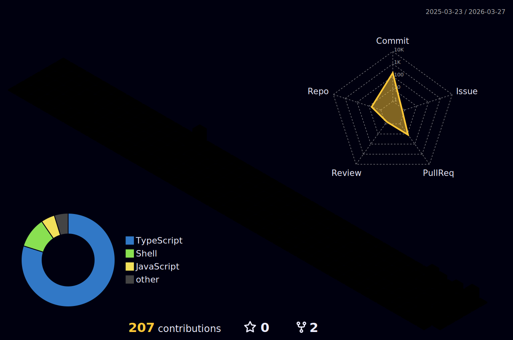

<!-- Capsule Header -->


<!-- Custom Neon Header -->
<p align="center">
  
</p>

<p align="center">
  <a href="https://facebook.com/tranvanluong9703"></a>
  <a href="mailto:your@email.com"></a>
  
</p>

---

<!-- Custom Terminal SVG -->
<p align="center">
  
</p>

---

<details open>
<summary><h2>About Me</h2></summary>

```yaml
name: Luong
role: Backend Developer
location: Vietnam (UTC+7)
focus: [Node.js, NestJS, Next.js, Electron]
passion: Building tools that automate everything
currently_learning: System Design & Scalable Architecture
```

- Building backend services with **NestJS** and frontend with **Next.js**
- Developing desktop applications with **Electron**
- Automating everything with **Puppeteer** & custom tooling
- Open source contributor & automation enthusiast

</details>

---

<details>
<summary><h2>Tech Stack</h2></summary>

<div align="center">

[](https://skillicons.dev)

</div>

| Category | Technologies |
|----------|-------------|
| **Languages** | TypeScript, JavaScript |
| **Backend** | Node.js, NestJS |
| **Frontend** | Next.js |
| **Desktop** | Electron |
| **Database** | SQLite, TypeORM |
| **Automation** | Puppeteer |
| **Tools** | Git, VS Code |

</details>

---

<details open>
<summary><h2>Featured Projects</h2></summary>

<div align="center">

| Project | Description | Tech |
|---------|-------------|------|
| [**chrome-downgrader**](https://github.com/tranluong460/chrome-downgrader) | Tool for downgrading Chrome browser versions |  |
| [**base-factory**](https://github.com/tranluong460/base-factory) | Base project factory / boilerplate generator |  |
| [**core-project**](https://github.com/tranluong460/core-project) | Core project template & utilities |  |
| [**polyshop**](https://github.com/tranluong460/polyshop) | E-commerce application |  |
| [**datn**](https://github.com/tranluong460/datn) | Graduation thesis project |  |

</div>

</details>

---

<details open>
<summary><h2>GitHub Stats</h2></summary>

<p align="center">
  
</p>

<p align="center">
  
  
</p>

<p align="center">
  
  
</p>

<p align="center">
  
</p>

</details>

---

<details open>
<summary><h2>3D Contribution Chart</h2></summary>

<p align="center">
  
</p>

</details>

---

<details open>
<summary><h2>Snake Contribution</h2></summary>

<picture>
  <source media="(prefers-color-scheme: dark)" srcset="https://raw.githubusercontent.com/tranluong460/tranluong460/output/github-snake-dark.svg">
  <source media="(prefers-color-scheme: light)" srcset="https://raw.githubusercontent.com/tranluong460/tranluong460/output/github-snake.svg">
  
</picture>

</details>

---

<!--START_SECTION:waka-->
<!--END_SECTION:waka-->

---

<div align="center">

### Random Dev Quote

[](https://github.com/piyushsuthar/github-readme-quotes)

</div>

<!-- Footer -->

